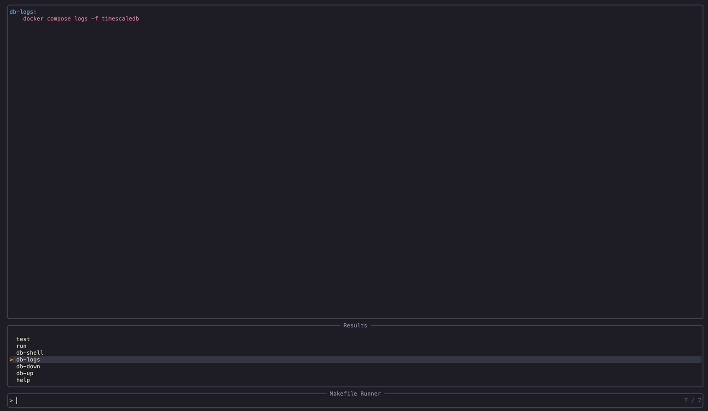

# make-runner.nvim

A Neovim plugin to browse and run Makefile recipes with [Telescope](https://github.com/nvim-telescope/telescope.nvim) or `vim.ui.select`, supporting multi-recipe chaining with ordered selection.

## Features

- Detects a `Makefile` in the current working directory
- Browse recipes with Telescope (with preview) or fallback to `vim.ui.select`
- Chain multiple recipes in order — runs `make build test` instead of just `make build`
- Preview recipe content with syntax highlighting
- Configurable: open in a new tab or a split

## Requirements

- Neovim >= 0.9
- [Telescope](https://github.com/nvim-telescope/telescope.nvim) (optional)

## Installation

With [lazy.nvim](https://github.com/folke/lazy.nvim):

```lua
{
    "lwsbrdx/make-runner.nvim",
    config = function()
        require("make-runner").setup()
    end
}
```

## Configuration

```lua
require("make-runner").setup({
    prompt_title = "Makefile Runner", -- picker title
    open_in = "tab",                  -- "tab" or "split"
    use_telescope = true,             -- set to false to always use vim.ui.select
})
```

## Usage

| Keymap | Action |
|--------|--------|
| `<leader>mr` | Open recipe picker |

### With Telescope

- `<Enter>` — run the selected recipe
- `<Tab>` — add a recipe to the chain (preserves order)
- `<Enter>` after tagging — run all tagged recipes in order

### With Telescope



### With vim.ui.select


- Select recipes one by one — the current selection is shown at the top
- Select `-> Run` to execute the chain
